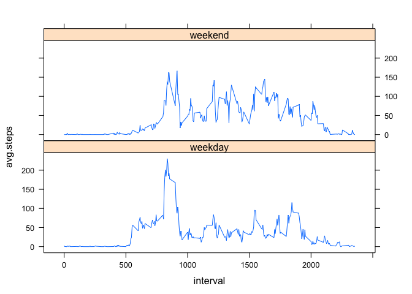

# Reproducible Research: Peer Assessment 1


## Loading and preprocessing the data

Load the data from the file 'activity.csv' in your working directory


```r
td <- read.csv("activity.csv")
```
Then process the data.


```r
library(plyr)
td$date <- as.Date(td$date)
td1 <- na.omit(td)
td2 <- ddply(td1,.(date),summarize,total.steps=sum(steps))
```

## What is mean total number of steps taken per day?

Generate the histogram using plot


```r
plot(total.steps ~date,td2,type="h")
```

 

Calculate the mean


```r
mean(td2$total.steps)
```

```
## [1] 10766.19
```

Calculate the median


```r
median(td2$total.steps)
```

```
## [1] 10765
```

## What is the average daily activity pattern?

Here is a time series plot


```r
td3 <-ddply(td1,.(interval),summarize,avg.steps=mean(steps))
plot(avg.steps ~interval,td3,type="l")
```

 

The maximum number of steps is: 


```r
max(td3$avg.steps)
```

```
## [1] 206.1698
```

And the corresponding five minute interval is:


```r
td3[which(td3$avg.steps>=206.1698),][1]
```

```
##     interval
## 104      835
```


## Imputing missing values

This calculates the number of NA values present


```r
sum(is.na(td$steps))
```

```
## [1] 2304
```

NA values are replaced by the average for the five-minute interval. The average for the five-minute interval is taken from the dataset for average daily activity pattern.


```r
library(dplyr)
```

```
## 
## Attaching package: 'dplyr'
## 
## The following objects are masked from 'package:plyr':
## 
##     arrange, count, desc, failwith, id, mutate, rename, summarise,
##     summarize
## 
## The following object is masked from 'package:stats':
## 
##     filter
## 
## The following objects are masked from 'package:base':
## 
##     intersect, setdiff, setequal, union
```

```r
#bind interval averages to frame with NA values
td4 <-cbind(td,as.integer(td3$avg.steps))

#replace NA values with interval averages
td5 <- mutate(td4,steps=ifelse(is.na(steps),as.integer(td3$avg.steps),steps))

td6 <- select(td5,steps,date,interval)
```

The histogram is created using plot


```r
#create histogram 
td7 <- ddply(td6,.(date),summarize,total.steps=sum(steps))
plot(total.steps ~date,td7,type="h")
```

 

The mean and median for the new dataset


```r
#mean
mean(td7$total.steps)
```

```
## [1] 10749.77
```

```r
#median
median(td7$total.steps)
```

```
## [1] 10641
```

There is a shift in values compared to the original dataset. The adding of imputed values has lowered both the mean and median.


## Are there differences in activity patterns between weekdays and weekends?

Here the dataset is modified to add a factor variable indicating 'weekday' or 'weekend'


```r
td8 <- mutate(td6,day= weekdays(date))
td9 <- mutate(td8, day=ifelse(day %in% c("Saturday","Sunday"),"weekend","weekday"))

td9 <- transform(td9, day = factor(day))

tdX <- ddply(td9,.(interval,day),summarize,avg.steps=mean(steps))
```

And a time series plot is generated to show differences in activity over weekdays and weekend.


```r
library("lattice")
xyplot(avg.steps ~ interval | day, data = tdX, type ="l", layout = c(1, 2))
```

 


